# All corrected diagrams — consolidated draft

A single review page collecting **every corrected diagram** in the documentation, verbatim from the authoritative source files. This is a draft for review and is not in the site navigation. Nothing here is a new diagram — each block is copied from the live docs after the source-code accuracy audit (commits `6788a9d` and `828d2be`).

Figure 2.1 (Kubernetes orchestration) is deliberately **not** reproduced here: it is a direct copy from a website and was left untouched.

## Contents

| Group | Diagrams | Source |
| --- | --- | --- |
| Architecture | 2 | `docs/concepts/architecture.md` |
| Design decisions | 1 | `docs/concepts/design-decisions.md` |
| Shared Java library | 2 | `docs/concepts/common-library.md` |
| Messaging | 1 | `docs/concepts/messaging.md` |
| Use cases | 1 | `docs/concepts/use-cases.md` |
| Certificate management | 1 | `docs/certificate-management.md` |
| Monitoring and logging | 1 | `docs/monitoring-and-logging.md` |
| Grafana Alloy | 1 | `docs/technologies/grafana-alloy.md` |
| Technology stack | 1 | `docs/technologies/overview.md` |
| Repository map | 1 | `docs/reference/repository.md` |
| Learning process | 1 | `docs/learning-process.md` |
| Thesis concept diagrams | 13 | `docs/_drafts/thesis-concepts.md` |
| Recreated figures 3.1 / 3.2 | 2 | `docs/_drafts/recreated/` |

## Architecture — component and data flow

**Source:** `docs/concepts/architecture.md`  
**Correction:** Verified accurate — no changes needed.

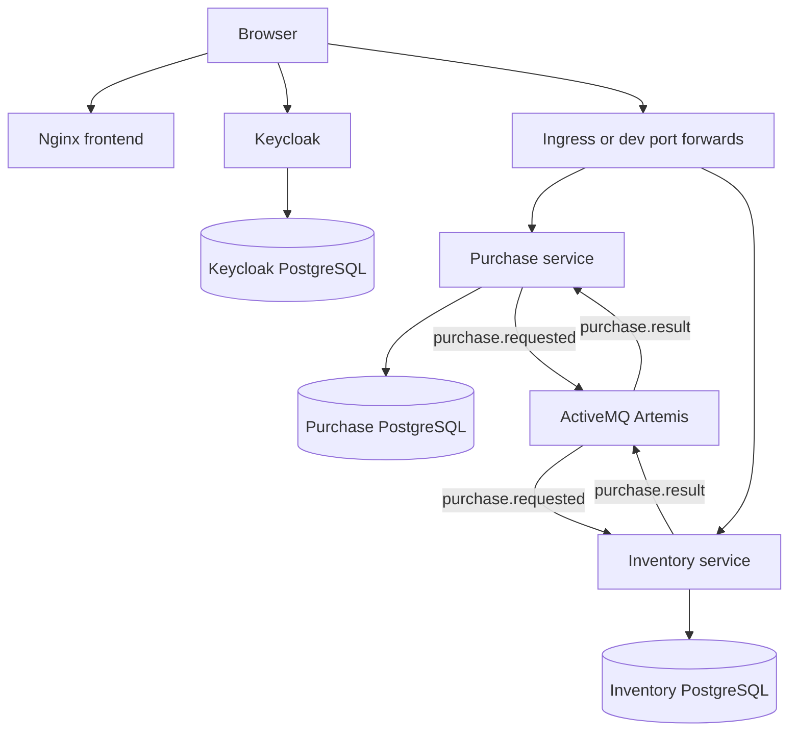
```mermaid
flowchart TB
  Browser[Browser] --> Frontend[Nginx frontend]
  Browser --> Keycloak[Keycloak]
  Browser --> Routing[Ingress or dev port forwards]
  Routing --> Purchase[Purchase service]
  Routing --> Inventory[Inventory service]
  Purchase --> PurchaseDB[(Purchase PostgreSQL)]
  Inventory --> InventoryDB[(Inventory PostgreSQL)]
  Keycloak --> AuthDB[(Keycloak PostgreSQL)]
  Purchase -->|purchase.requested| Artemis[ActiveMQ Artemis]
  Artemis -->|purchase.requested| Inventory
  Inventory -->|purchase.result| Artemis
  Artemis -->|purchase.result| Purchase
```

## Architecture — namespaces and environments

**Source:** `docs/concepts/architecture.md`  
**Correction:** Verified accurate — no changes needed.

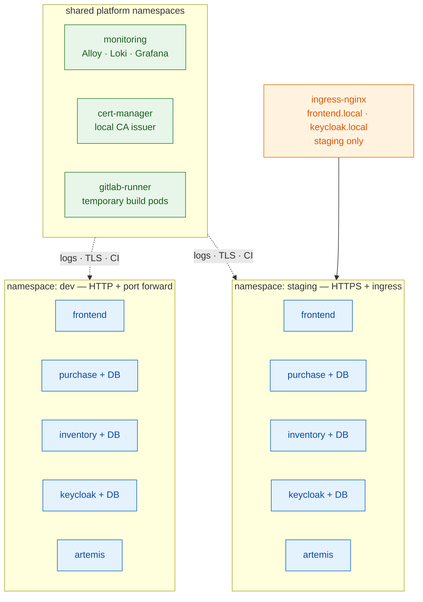
```mermaid
flowchart TB
  ING["ingress-nginx<br/>frontend.local · keycloak.local<br/>staging only"]

  subgraph DEV["namespace: dev — HTTP + port forward"]
    direction LR
    DF["frontend"]
    DP["purchase + DB"]
    DI["inventory + DB"]
    DK["keycloak + DB"]
    DA["artemis"]
  end

  subgraph STAGING["namespace: staging — HTTPS + ingress"]
    direction LR
    SF["frontend"]
    SP["purchase + DB"]
    SI["inventory + DB"]
    SK["keycloak + DB"]
    SA["artemis"]
  end

  subgraph SHARED["shared platform namespaces"]
    direction LR
    MON["monitoring<br/>Alloy · Loki · Grafana"]
    CA["cert-manager<br/>local CA issuer"]
    RUN["gitlab-runner<br/>temporary build pods"]
  end

  ING --> STAGING
  SHARED -.->|"logs · TLS · CI"| DEV
  SHARED -.->|"logs · TLS · CI"| STAGING

  classDef env fill:#e3f2fd,stroke:#1565c0,color:#0d47a1;
  classDef platform fill:#e8f5e9,stroke:#2e7d32,color:#1b5e20;
  classDef ingress fill:#fff3e0,stroke:#ef6c00,color:#e65100;
  class DF,DP,DI,DK,DA,SF,SP,SI,SK,SA env;
  class MON,CA,RUN platform;
  class ING ingress;
```

## Design decisions — nine layers

**Source:** `docs/concepts/design-decisions.md`  
**Correction:** PKI now secures ingress (L1) and provides TLS for Keycloak (L4); CI/CD now deploys into Kubernetes instead of being downstream of it; observability observes all Pods.

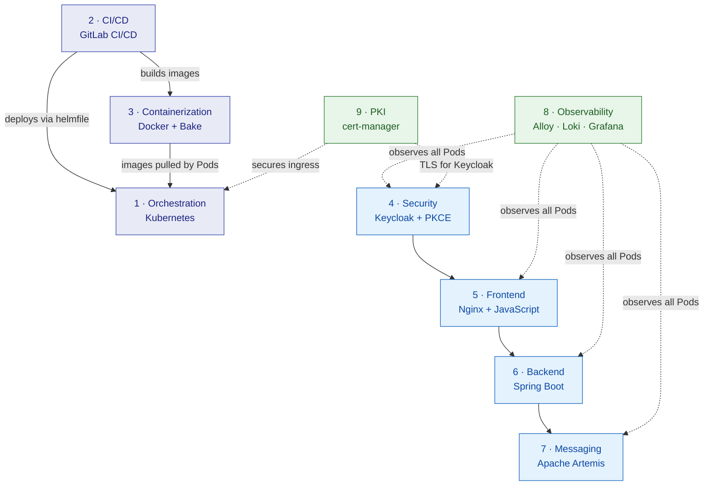
```mermaid
flowchart TB
  L1["1 · Orchestration<br/>Kubernetes"]
  L2["2 · CI/CD<br/>GitLab CI/CD"]
  L3["3 · Containerization<br/>Docker + Bake"]
  L4["4 · Security<br/>Keycloak + PKCE"]
  L5["5 · Frontend<br/>Nginx + JavaScript"]
  L6["6 · Backend<br/>Spring Boot"]
  L7["7 · Messaging<br/>Apache Artemis"]
  L8["8 · Observability<br/>Alloy · Loki · Grafana"]
  L9["9 · PKI<br/>cert-manager"]

  L2 -->|"deploys via helmfile"| L1
  L2 -->|"builds images"| L3
  L3 -->|"images pulled by Pods"| L1
  L4 --> L5 --> L6 --> L7
  L8 -.->|"observes all Pods"| L4
  L8 -.->|"observes all Pods"| L5
  L8 -.->|"observes all Pods"| L6
  L8 -.->|"observes all Pods"| L7
  L9 -.->|"secures ingress"| L1
  L9 -.->|"TLS for Keycloak"| L4

  classDef platform fill:#e8eaf6,stroke:#3949ab,color:#1a237e;
  classDef app fill:#e3f2fd,stroke:#1565c0,color:#0d47a1;
  classDef cross fill:#e8f5e9,stroke:#2e7d32,color:#1b5e20;
  class L1,L2,L3 platform;
  class L4,L5,L6,L7 app;
  class L8,L9 cross;
```

## Shared Java library — Maven hierarchy and events

**Source:** `docs/concepts/common-library.md`  
**Correction:** Verified accurate. The event table in the source page was corrected from "Serializable" to "JSON-serializable".

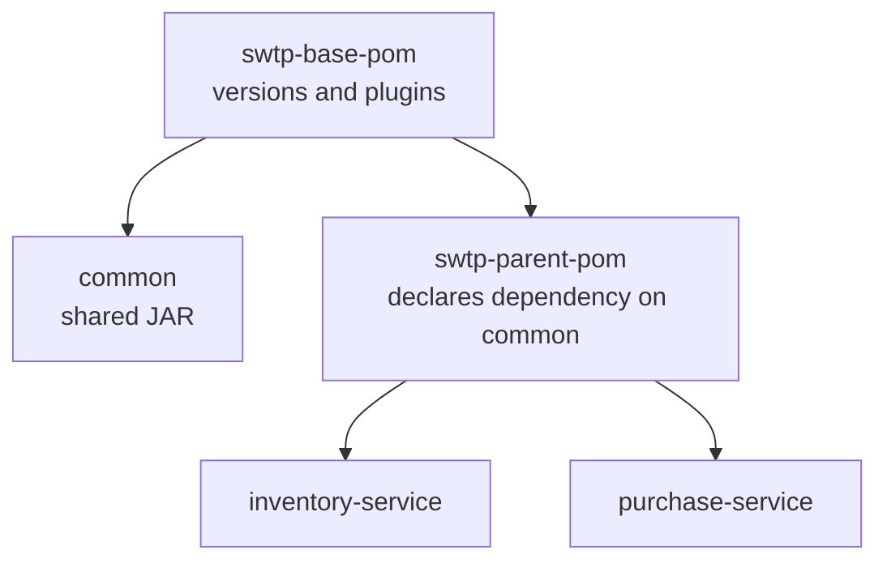
```mermaid
flowchart TB
  base["swtp-base-pom<br/>versions and plugins"] --> common["common<br/>shared JAR"]
  base --> parent["swtp-parent-pom<br/>declares dependency on common"]
  parent --> inventory["inventory-service"]
  parent --> purchase["purchase-service"]
```

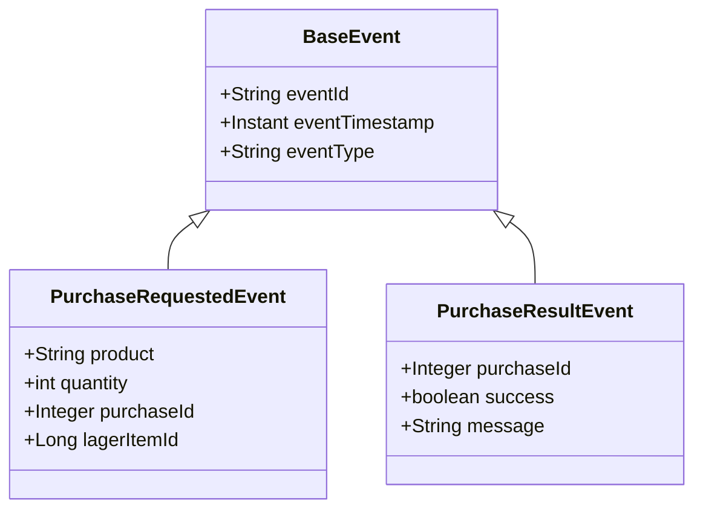
```mermaid
classDiagram
  class BaseEvent {
    +String eventId
    +Instant eventTimestamp
    +String eventType
  }
  class PurchaseRequestedEvent {
    +String product
    +int quantity
    +Integer purchaseId
    +Long lagerItemId
  }
  class PurchaseResultEvent {
    +Integer purchaseId
    +boolean success
    +String message
  }
  BaseEvent <|-- PurchaseRequestedEvent
  BaseEvent <|-- PurchaseResultEvent
```

## Messaging — purchase sequence

**Source:** `docs/concepts/messaging.md`  
**Correction:** Verified accurate against the listeners and queue constants.

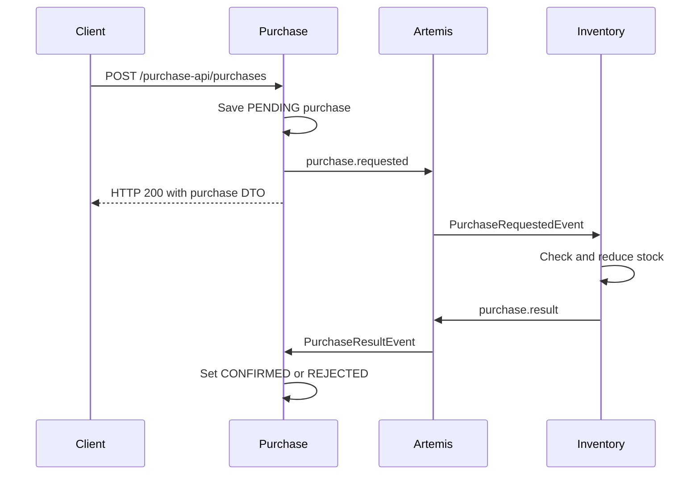
```mermaid
sequenceDiagram
  participant Client
  participant Purchase
  participant Broker as Artemis
  participant Inventory
  Client->>Purchase: POST /purchase-api/purchases
  Purchase->>Purchase: Save PENDING purchase
  Purchase->>Broker: purchase.requested
  Purchase-->>Client: HTTP 200 with purchase DTO
  Broker->>Inventory: PurchaseRequestedEvent
  Inventory->>Inventory: Check and reduce stock
  Inventory->>Broker: purchase.result
  Broker->>Purchase: PurchaseResultEvent
  Purchase->>Purchase: Set CONFIRMED or REJECTED
```

## Use cases — purchase workflow

**Source:** `docs/concepts/use-cases.md`  
**Correction:** The final status update is now attributed to the Purchase result listener, not to Artemis.

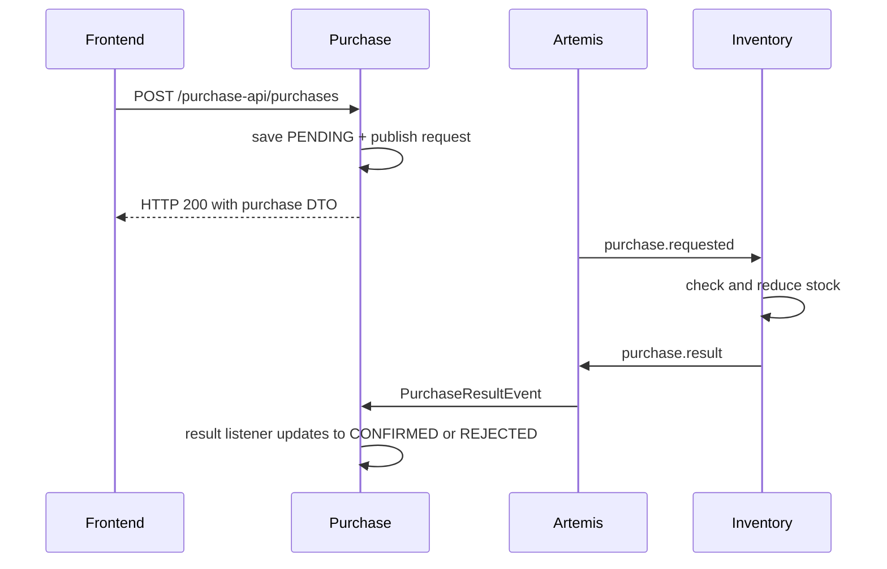
```mermaid
sequenceDiagram
  participant UI as Frontend
  participant Purchase
  participant Artemis
  participant Inventory
  UI->>Purchase: POST /purchase-api/purchases
  Purchase->>Purchase: save PENDING + publish request
  Purchase-->>UI: HTTP 200 with purchase DTO
  Artemis->>Inventory: purchase.requested
  Inventory->>Inventory: check and reduce stock
  Inventory->>Artemis: purchase.result
  Artemis->>Purchase: PurchaseResultEvent
  Purchase->>Purchase: result listener updates to CONFIRMED or REJECTED
```

## Certificate management — TLS chain

**Source:** `docs/certificate-management.md`  
**Correction:** Verified accurate against the CA issuer and ingress templates.

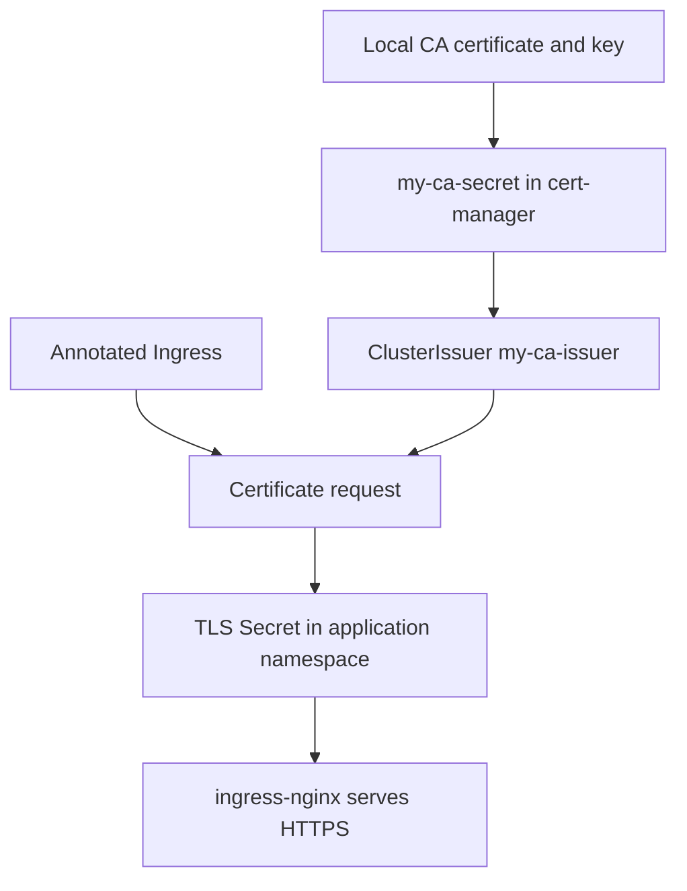
```mermaid
flowchart TB
  CA[Local CA certificate and key] --> Secret[my-ca-secret in cert-manager]
  Secret --> Issuer[ClusterIssuer my-ca-issuer]
  Ingress[Annotated Ingress] --> Certificate[Certificate request]
  Issuer --> Certificate
  Certificate --> TLS[TLS Secret in application namespace]
  TLS --> Nginx[ingress-nginx serves HTTPS]
```

## Monitoring — log flow

**Source:** `docs/monitoring-and-logging.md`  
**Correction:** Verified accurate against the Alloy ConfigMap and Grafana data source.

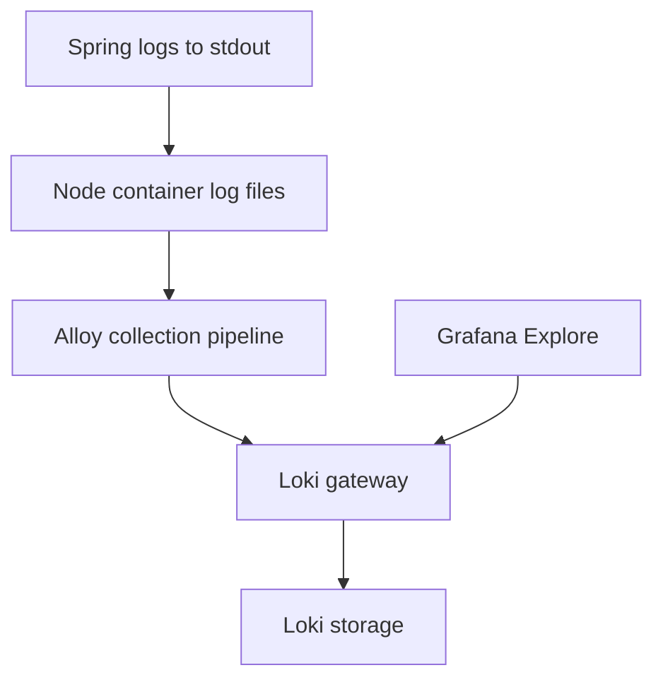
```mermaid
flowchart TB
  Java[Spring logs to stdout] --> Runtime[Node container log files]
  Runtime --> Alloy[Alloy collection pipeline]
  Alloy --> Gateway[Loki gateway]
  Gateway --> Loki[Loki storage]
  Grafana[Grafana Explore] --> Gateway
```

## Grafana Alloy — component pipeline

**Source:** `docs/technologies/grafana-alloy.md`  
**Correction:** Exact match to the checked-in Alloy configuration.

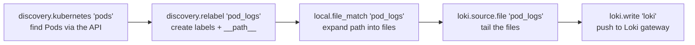
```mermaid
flowchart LR
  A["discovery.kubernetes 'pods'<br/>find Pods via the API"] --> B["discovery.relabel 'pod_logs'<br/>create labels + __path__"]
  B --> C["local.file_match 'pod_logs'<br/>expand path into files"]
  C --> D["loki.source.file 'pod_logs'<br/>tail the files"]
  D --> E["loki.write 'loki'<br/>push to Loki gateway"]
```

## Technology stack — build and deploy flow

**Source:** `docs/technologies/overview.md`  
**Correction:** Split the single registry into host (`localhost:5000`) and CI (`registry.kube-system...:80`) registries; added the Makefile path.

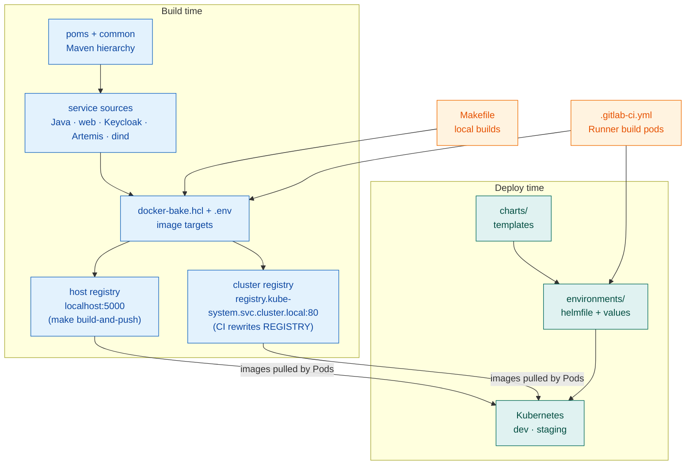
```mermaid
flowchart TB
  subgraph BUILD["Build time"]
    direction LR
    POM["poms + common<br/>Maven hierarchy"]
    SRC["service sources<br/>Java · web · Keycloak · Artemis · dind"]
    BAKE["docker-bake.hcl + .env<br/>image targets"]
    REG_LOCAL["host registry<br/>localhost:5000<br/>(make build-and-push)"]
    REG_CI["cluster registry<br/>registry.kube-system.svc.cluster.local:80<br/>(CI rewrites REGISTRY)"]
    POM --> SRC --> BAKE
    BAKE --> REG_LOCAL
    BAKE --> REG_CI
  end

  subgraph DEPLOY["Deploy time"]
    direction LR
    CH["charts/<br/>templates"]
    HF["environments/<br/>helmfile + values"]
    K8S["Kubernetes<br/>dev · staging"]
    CH --> HF --> K8S
  end

  MAKE["Makefile<br/>local builds"] --> BAKE
  CI[".gitlab-ci.yml<br/>Runner build pods"] --> BAKE
  CI --> HF
  REG_LOCAL -->|"images pulled by Pods"| K8S
  REG_CI -->|"images pulled by Pods"| K8S

  classDef build fill:#e3f2fd,stroke:#1565c0,color:#0d47a1;
  classDef deploy fill:#e0f2f1,stroke:#00695c,color:#004d40;
  classDef ci fill:#fff3e0,stroke:#ef6c00,color:#e65100;
  class POM,SRC,BAKE,REG_LOCAL,REG_CI build;
  class CH,HF,K8S deploy;
  class CI,MAKE ci;
```

## Repository map

**Source:** `docs/reference/repository.md`  
**Correction:** `scripts/` and `portforwarding/` are now separate nodes; the Kubernetes node lists all shared namespaces.

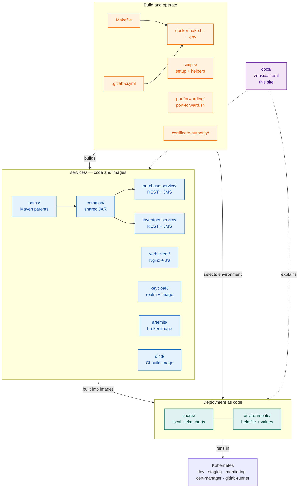
```mermaid
flowchart TB
  subgraph CODE["services/ — code and images"]
    direction LR
    POMS["poms/<br/>Maven parents"]
    COMMON["common/<br/>shared JAR"]
    PUR["purchase-service/<br/>REST + JMS"]
    INV["inventory-service/<br/>REST + JMS"]
    WEB["web-client/<br/>Nginx + JS"]
    KC["keycloak/<br/>realm + image"]
    ART["artemis/<br/>broker image"]
    DIND["dind/<br/>CI build image"]
    POMS --> COMMON
    COMMON --> PUR
    COMMON --> INV
  end

  subgraph DEPLOY["Deployment as code"]
    direction LR
    CHARTS["charts/<br/>local Helm charts"]
    ENV["environments/<br/>helmfile + values"]
    CHARTS --- ENV
  end

  subgraph OPS["Build and operate"]
    direction LR
    MAKE["Makefile"]
    BAKE["docker-bake.hcl<br/>+ .env"]
    SCRIPTS["scripts/<br/>setup + helpers"]
    PF["portforwarding/<br/>port-forward.sh"]
    CA["certificate-authority/"]
    CI[".gitlab-ci.yml"]
    MAKE --> BAKE
    CI --> BAKE
  end

  DOCS["docs/<br/>zensical.toml<br/>this site"]
  K8S["Kubernetes<br/>dev · staging · monitoring ·<br/>cert-manager · gitlab-runner"]

  CODE -->|"built into images"| DEPLOY
  OPS -->|"builds"| CODE
  OPS -->|"selects environment"| DEPLOY
  DEPLOY -->|"runs in"| K8S
  DOCS -.->|"explains"| CODE
  DOCS -.->|"explains"| DEPLOY

  classDef code fill:#e3f2fd,stroke:#1565c0,color:#0d47a1;
  classDef deploy fill:#e0f2f1,stroke:#00695c,color:#004d40;
  classDef ops fill:#fff3e0,stroke:#ef6c00,color:#e65100;
  classDef docs fill:#f3e5f5,stroke:#6a1b9a,color:#4a148c;
  class POMS,COMMON,PUR,INV,WEB,KC,ART,DIND code;
  class CHARTS,ENV deploy;
  class MAKE,BAKE,SCRIPTS,PF,CA,CI ops;
  class DOCS docs;
```

## Learning process — phases

**Source:** `docs/learning-process.md`  
**Correction:** Verified accurate against the project history.

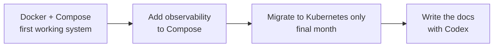
```mermaid
flowchart LR
  A["Docker + Compose<br/>first working system"]
  B["Add observability<br/>to Compose"]
  C["Migrate to Kubernetes only<br/>final month"]
  D["Write the docs<br/>with Codex"]
  A --> B --> C --> D
```

## Thesis concept diagrams (13)

These reconstruct flows described in the thesis but never drawn as figures. Where the thesis uses an illustrative example that differs from the deployed system, the source page labels it explicitly. Full source: [`docs/_drafts/thesis-concepts.md`](thesis-concepts.md).

### Concept diagram 1

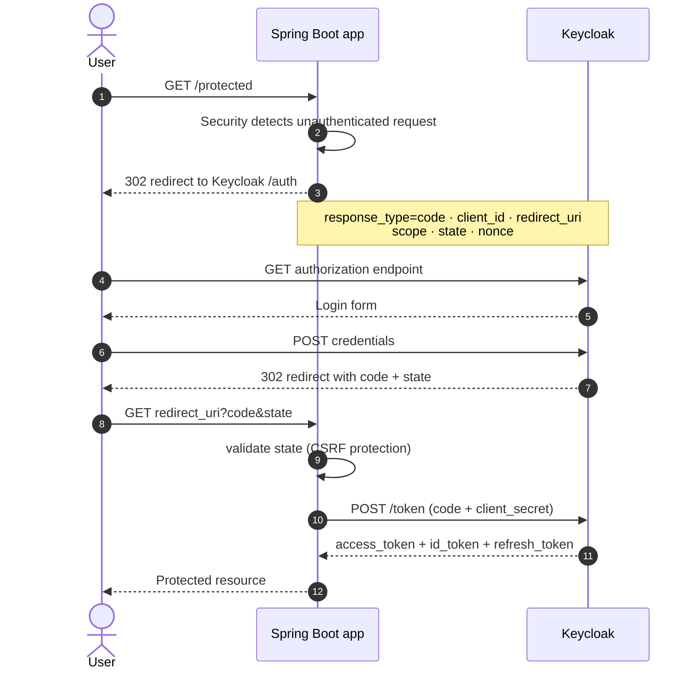
```mermaid
sequenceDiagram
  autonumber
  actor User
  participant App as Spring Boot app
  participant KC as Keycloak
  User->>App: GET /protected
  App->>App: Security detects unauthenticated request
  App-->>User: 302 redirect to Keycloak /auth
  Note over App,KC: response_type=code · client_id · redirect_uri<br/>scope · state · nonce
  User->>KC: GET authorization endpoint
  KC-->>User: Login form
  User->>KC: POST credentials
  KC-->>User: 302 redirect with code + state
  User->>App: GET redirect_uri?code&state
  App->>App: validate state (CSRF protection)
  App->>KC: POST /token (code + client_secret)
  KC-->>App: access_token + id_token + refresh_token
  App-->>User: Protected resource
```

### Concept diagram 2

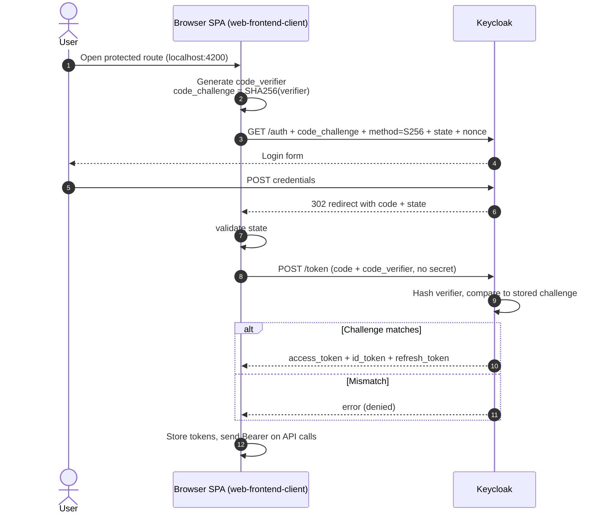
```mermaid
sequenceDiagram
  autonumber
  actor User
  participant SPA as Browser SPA (web-frontend-client)
  participant KC as Keycloak
  User->>SPA: Open protected route (localhost:4200)
  SPA->>SPA: Generate code_verifier<br/>code_challenge = SHA256(verifier)
  SPA->>KC: GET /auth + code_challenge + method=S256 + state + nonce
  KC-->>User: Login form
  User->>KC: POST credentials
  KC-->>SPA: 302 redirect with code + state
  SPA->>SPA: validate state
  SPA->>KC: POST /token (code + code_verifier, no secret)
  KC->>KC: Hash verifier, compare to stored challenge
  alt Challenge matches
    KC-->>SPA: access_token + id_token + refresh_token
  else Mismatch
    KC-->>SPA: error (denied)
  end
  SPA->>SPA: Store tokens, send Bearer on API calls
```

### Concept diagram 3

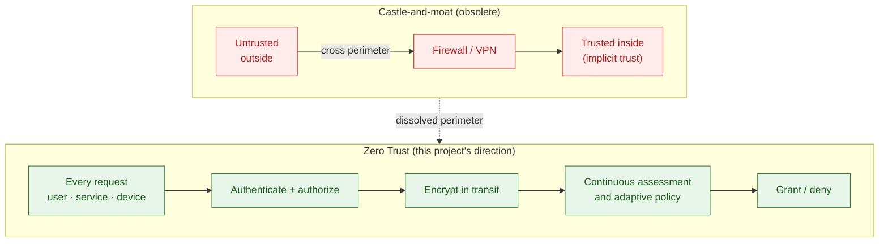
```mermaid
flowchart TB
  subgraph OLD["Castle-and-moat (obsolete)"]
    direction LR
    U1["Untrusted<br/>outside"] -->|"cross perimeter"| FW["Firewall / VPN"]
    FW --> T1["Trusted inside<br/>(implicit trust)"]
  end
  subgraph NEW["Zero Trust (this project's direction)"]
    direction LR
    REQ["Every request<br/>user · service · device"] --> AUTH["Authenticate + authorize"]
    AUTH --> ENC["Encrypt in transit"]
    ENC --> POL["Continuous assessment<br/>and adaptive policy"]
    POL --> OK["Grant / deny"]
  end
  OLD -.->|"dissolved perimeter"| NEW
  classDef bad fill:#fdecea,stroke:#c62828,color:#b71c1c;
  classDef good fill:#e8f5e9,stroke:#2e7d32,color:#1b5e20;
  class U1,FW,T1 bad;
  class REQ,AUTH,ENC,POL,OK good;
```

### Concept diagram 4

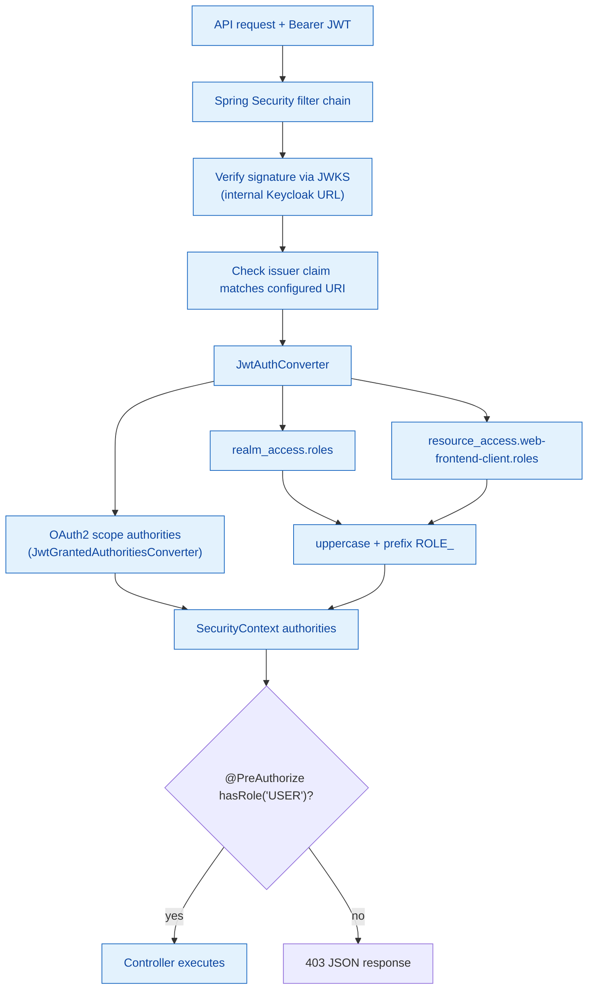
```mermaid
flowchart TB
  REQ["API request + Bearer JWT"] --> SF["Spring Security filter chain"]
  SF --> VERIFY["Verify signature via JWKS<br/>(internal Keycloak URL)"]
  VERIFY --> ISS["Check issuer claim matches configured URI"]
  ISS --> CONV["JwtAuthConverter"]
  CONV --> SCP["OAuth2 scope authorities<br/>(JwtGrantedAuthoritiesConverter)"]
  CONV --> R1["realm_access.roles"]
  CONV --> R2["resource_access.web-frontend-client.roles"]
  R1 --> MAP["uppercase + prefix ROLE_"]
  R2 --> MAP
  SCP --> CTX["SecurityContext authorities"]
  MAP --> CTX
  CTX --> AUTHZ{"@PreAuthorize hasRole('USER')?"}
  AUTHZ -->|yes| OK["Controller executes"]
  AUTHZ -->|no| DENY["403 JSON response"]
  classDef flow fill:#e3f2fd,stroke:#1565c0,color:#0d47a1;
  class REQ,SF,VERIFY,ISS,CONV,SCP,R1,R2,MAP,CTX,OK flow;
```

### Concept diagram 5

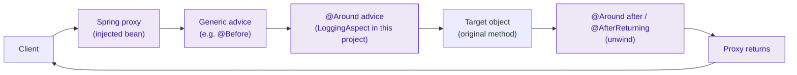
```mermaid
flowchart LR
  C["Client"] --> P["Spring proxy<br/>(injected bean)"]
  P --> A1["Generic advice<br/>(e.g. @Before)"]
  A1 --> A2["@Around advice<br/>(LoggingAspect in this project)"]
  A2 --> T["Target object<br/>(original method)"]
  T --> A2B["@Around after / @AfterReturning<br/>(unwind)"]
  A2B --> P2["Proxy returns"]
  P2 --> C
  classDef proxy fill:#ede7f6,stroke:#5e35b1,color:#311b92;
  class P,A1,A2,A2B,P2 proxy;
```

### Concept diagram 6

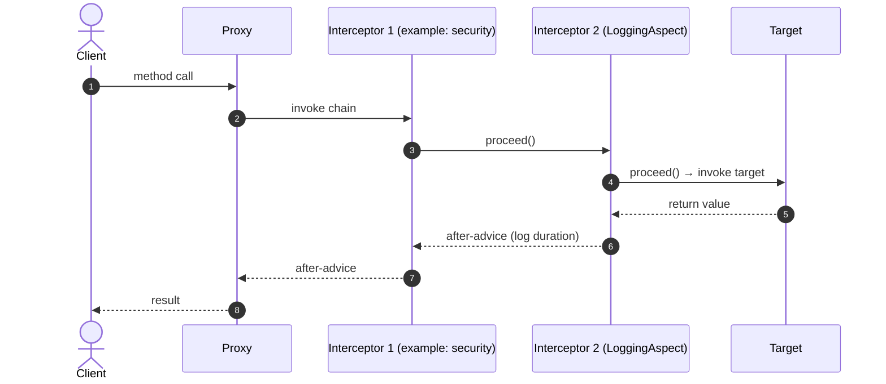
```mermaid
sequenceDiagram
  autonumber
  actor Client
  participant Proxy
  participant A1 as Interceptor 1 (example: security)
  participant A2 as Interceptor 2 (LoggingAspect)
  participant Target
  Client->>Proxy: method call
  Proxy->>A1: invoke chain
  A1->>A2: proceed()
  A2->>Target: proceed() → invoke target
  Target-->>A2: return value
  A2-->>A1: after-advice (log duration)
  A1-->>Proxy: after-advice
  Proxy-->>Client: result
```

### Concept diagram 7

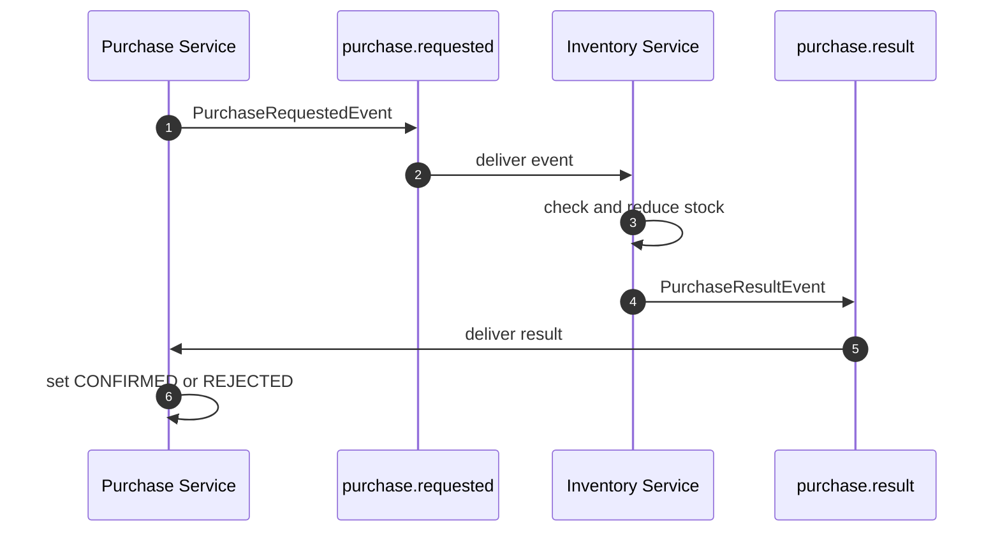
```mermaid
sequenceDiagram
  autonumber
  participant P as Purchase Service
  participant RQ as purchase.requested
  participant I as Inventory Service
  participant PQ as purchase.result
  P->>RQ: PurchaseRequestedEvent
  RQ->>I: deliver event
  I->>I: check and reduce stock
  I->>PQ: PurchaseResultEvent
  PQ->>P: deliver result
  P->>P: set CONFIRMED or REJECTED
```

### Concept diagram 8

```mermaid
classDiagram
  class BaseEvent {
    <<abstract>>
    +String eventId
    +Instant eventTimestamp
    +String eventType
    +_type discriminator: PurchaseRequested | PurchaseResult
  }
  class PurchaseRequestedEvent {
    +String product
    +int quantity
    +Integer purchaseId
    +Long lagerItemId
  }
  class PurchaseResultEvent {
    +Integer purchaseId
    +boolean success
    +String message
  }
  BaseEvent <|-- PurchaseRequestedEvent
  BaseEvent <|-- PurchaseResultEvent
```

### Concept diagram 9

```mermaid
flowchart TB
  PL["PropertyLogger<br/>(startup configuration log)"]
  V["EarlyLoggingValve<br/>Tomcat: raw request + final status"]
  S["Spring Security<br/>authenticate + authorize"]
  M["MdcJwtFilter<br/>userId + username into MDC"]
  C["Controllers"]
  A["LoggingAspect (@Around)<br/>entry/exit/duration + Micrometer"]
  B["Business logic"]
  L["logback-spring.xml<br/>human-readable (dev) / JSON (staging)"]
  V --> S --> M --> C --> A --> B
  A -.->|"clear method/class"| A
  M -.->|"clear MDC on return"| M
  V -.->|"final status"| L
  A -.-> L
  M -.-> L
  classDef log fill:#e8f5e9,stroke:#2e7d32,color:#1b5e20;
  class PL,V,M,A,L log;
```

### Concept diagram 10

```mermaid
flowchart LR
  J["Spring JSON to stdout"] --> F["Node container log files"]
  F --> AL["Alloy discovery + relabel + file_match + source.file"]
  AL --> GW_W["loki-gateway<br/>(write /push)"]
  GW_W --> LS["Loki storage (singleBinary + MinIO/S3)"]
  G["Grafana Explore"] --> GW_R["loki-gateway<br/>(read/query)"]
  LS --> GW_R
  classDef obs fill:#fff3e0,stroke:#ef6c00,color:#e65100;
  class AL,GW_W,LS,GW_R,G obs;
```

### Concept diagram 11

```mermaid
flowchart LR
  START["Service startup"] --> F["Flyway enabled"]
  F --> HIST["Create / validate<br/>flyway_schema_history"]
  HIST --> LOC["Scan classpath:db/migration"]
  LOC --> V1["V1__init.sql<br/>create table"]
  V1 --> H1["history updated"]
  H1 --> V2["V2__addData.sql<br/>seed rows"]
  V2 --> H2["history updated"]
  H2 --> APP["Application ready"]
```

### Concept diagram 12

```mermaid
flowchart TB
  ENV[".env<br/>image versions"] --> BAKE["docker-bake.hcl"]
  BAKE --> BASE["base-images: builder-common"]
  BAKE --> IND["independent targets:<br/>nginx-frontend · artemis · keycloak · dind"]
  BASE --> JAVA["inventory-service · purchase-service<br/>(inherit builder-common)"]
  JAVA --> PUSH["push to registry<br/>host: localhost:5000/<br/>CI: registry.kube-system.svc.cluster.local:80/"]
  IND --> PUSH
  PUSH --> K8S["Pods pull images in-cluster"]
```

### Concept diagram 13

```mermaid
sequenceDiagram
  autonumber
  actor Dev
  participant GL as GitLab
  participant R as GitLab Runner
  participant K as Kubernetes API
  participant Pod as Ephemeral Build Pod (dind)
  Dev->>GL: git push
  GL->>R: pipeline jobs (test, build, deploy)
  loop one ephemeral Pod per job
    R->>K: create Build Pod
    K-->>Pod: schedule
    Pod->>Pod: clone repo
    Pod->>Pod: job script (test / build+push / helmfile sync)
    Pod-->>R: job status
    R->>K: delete Build Pod
  end
  R-->>GL: report pipeline status
```

## Recreated figures 3.1 and 3.2

Vector re-creations with real brand logos (Simple Icons CC0, Firefox and ActiveMQ from Wikimedia). Source: [`docs/_drafts/recreated-figures.md`](recreated-figures.md). Figure 2.1 is excluded because it is a direct website copy.

### Figure 3.1 — Overall architecture and internal logic

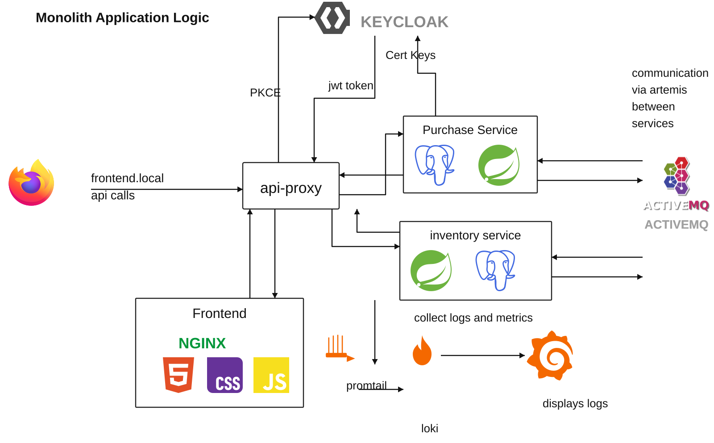

### Figure 3.2 — High-level Kubernetes architecture

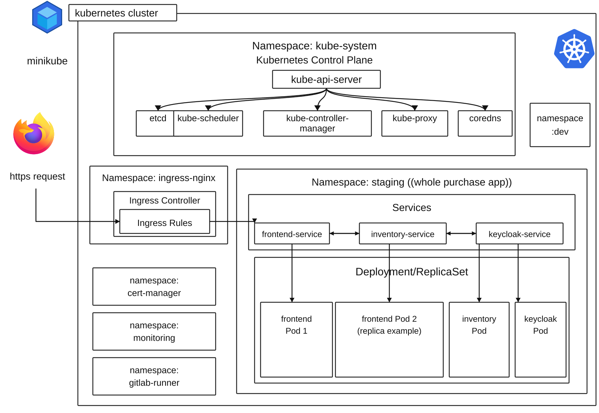
